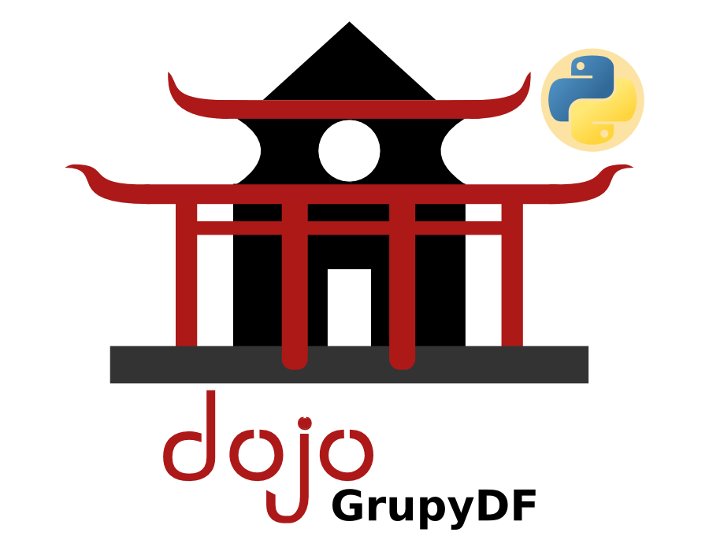
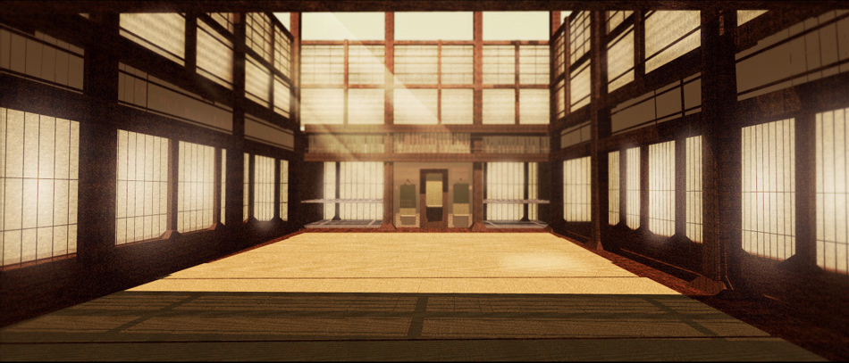
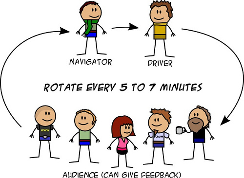

 <!-- .element: style="width: 77%;" -->

---

## O que é um dojo?

 <!-- .element: class="fragment" data-fragment-index="1" -->

---

## É um lugar para:

- Reunir os amigos <!-- .element: class="fragment" data-fragment-index="1" -->
- Programar <!-- .element: class="fragment" data-fragment-index="2" -->
- Trocar XP <!-- .element: class="fragment" data-fragment-index="3" -->
- Aprender <!-- .element: class="fragment" data-fragment-index="4" -->
- Se divertir <!-- .element: class="fragment" data-fragment-index="5" -->

---

## Dinâmica

---

## TDD
### Test Driven Development

- Escrever o teste primeiro <!-- .element: class="fragment" data-fragment-index="1" -->
- Fazer o teste passar <!-- .element: class="fragment" data-fragment-index="2" -->
- Babysteps <!-- .element: class="fragment" data-fragment-index="3" -->

---

## No final...

- Prós <!-- .element: class="fragment" data-fragment-index="1" -->
- Contras <!-- .element: class="fragment" data-fragment-index="2" -->
- Sugestões <!-- .element: class="fragment" data-fragment-index="3" -->
- Comentários <!-- .element: class="fragment" data-fragment-index="4" -->

---

# \#partiu!
